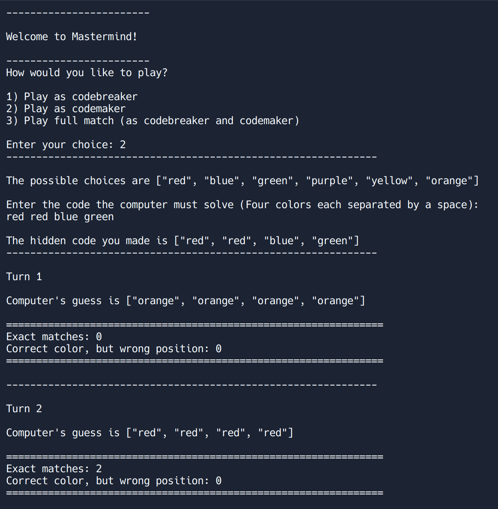
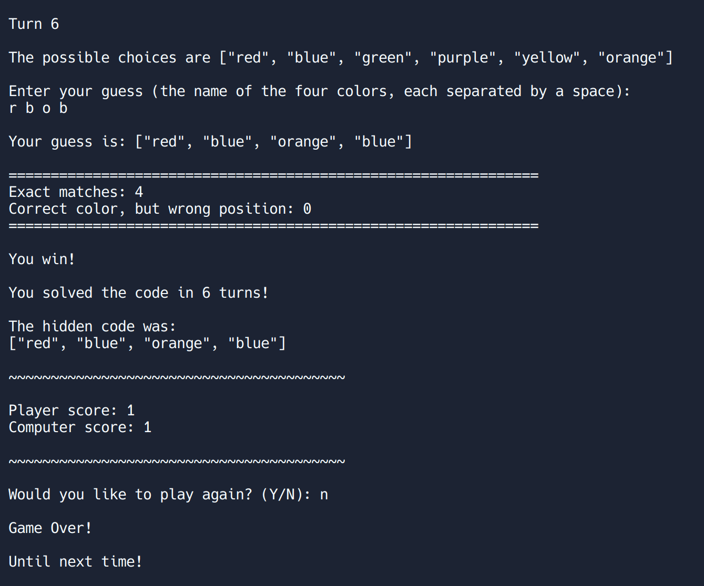

# Project: Mastermind

## Project Preview

 

:link: A **live demo** of this project can be found
[here](https://replit.com/@PotaytoDev/Mastermind#main.rb). However, due to a recent
change in the service, an account needs to be created first before the project can
be forked and ran. 

## Description

This is my implementation of the
[Mastermind Project](https://www.theodinproject.com/lessons/ruby-mastermind)
from [**The Odin Project**](https://www.theodinproject.com/) curriculum in the Object
Oriented Programming Basics section of the Ruby course.

This is the second major project in the Ruby Course of The Odin Project curriculum.
The project consists of a basic console implementation of the classic Mastermind board
game meant to serve as practice for learning Object Oriented Programming with Ruby.

In this project, I continued practicing the skills that I had learned from The Odin
Project curriculum so far. I used a hash for the first time in a project outside of
the exercises from the curriculum and I continued to use arrays and their related
methods to store and manipulate data.

A difficult challenge that I came across working on this project was coming up with
an algorithm for the computer to guess the player's secret code since it required
understanding the logic for how to best go about making guesses and solving the code,
while keeping it simple enough to implement the necessary steps.

## Features

This implementation of the Mastermind game consists of two players, the user and the computer.

The rules of the game consist of one player creating a secret code made up of 4 out of 6
different color choices, while the other player tries to crack the code by guessing the
correct colors and their positions within the secret code. The game allows for repetition
of colors, so a possible secret code could be something like: `red, red, blue, green`. The
player cracking the secret code has 12 turns to correctly guess the secret code and
will lose if they run out of turns before guessing it correctly.

Upon running the program, the user can select whether they want to player as the **codemaker**,
and create a secret code for the computer to crack, or to play as the **codebreaker**, and crack
the secret code the computer has created.

## Reflection

A short blog post containing some of my thoughts on the project can be found
[here](https://potayto.notion.site/Project-Mastermind-1b42e46002e64fc0b3ffa4b5bc91488b).
